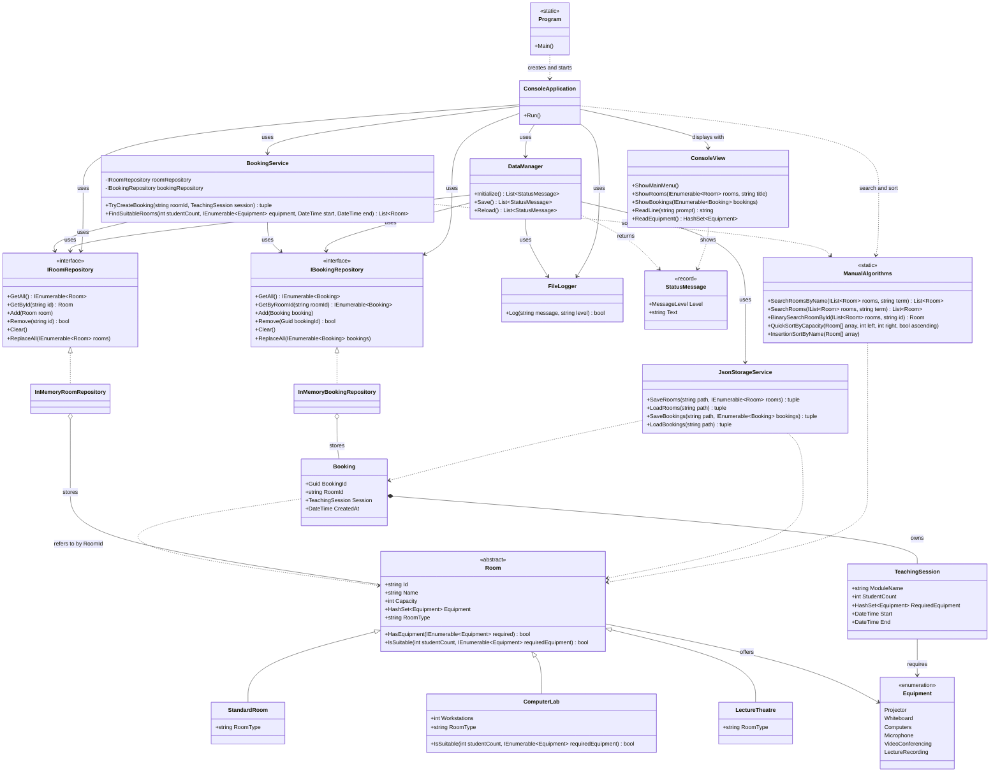
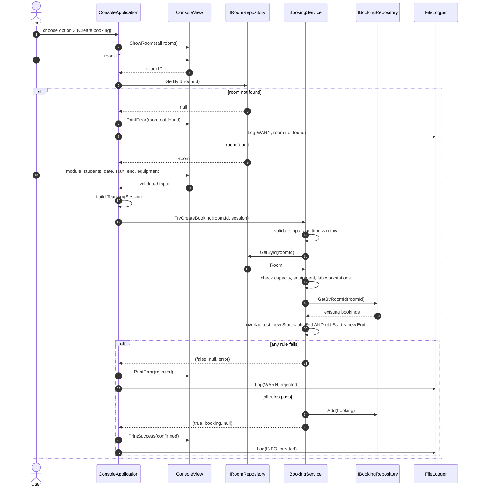
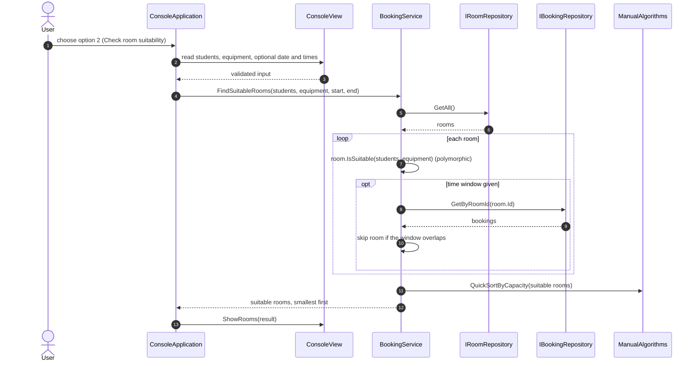

# Design diagrams

## UML class diagram

```mermaid
classDiagram
direction TB

class Room {
  <<abstract>>
  +string Id
  +string Name
  +int Capacity
  +HashSet~Equipment~ Equipment
  +string RoomType
  +HasEquipment(IEnumerable~Equipment~ required) bool
  +IsSuitable(int studentCount, IEnumerable~Equipment~ requiredEquipment) bool
}
class StandardRoom {
  +string RoomType
}
class ComputerLab {
  +int Workstations
  +string RoomType
  +IsSuitable(int studentCount, IEnumerable~Equipment~ requiredEquipment) bool
}
class LectureTheatre {
  +string RoomType
}
class Equipment {
  <<enumeration>>
  Projector
  Whiteboard
  Computers
  Microphone
  VideoConferencing
  LectureRecording
}
class TeachingSession {
  +string ModuleName
  +int StudentCount
  +HashSet~Equipment~ RequiredEquipment
  +DateTime Start
  +DateTime End
}
class Booking {
  +Guid BookingId
  +string RoomId
  +TeachingSession Session
  +DateTime CreatedAt
}
class IRoomRepository {
  <<interface>>
  +GetAll() IEnumerable~Room~
  +GetById(string id) Room
  +Add(Room room)
  +Remove(string id) bool
  +Clear()
  +ReplaceAll(IEnumerable~Room~ rooms)
}
class IBookingRepository {
  <<interface>>
  +GetAll() IEnumerable~Booking~
  +GetByRoomId(string roomId) IEnumerable~Booking~
  +Add(Booking booking)
  +Remove(Guid bookingId) bool
  +Clear()
  +ReplaceAll(IEnumerable~Booking~ bookings)
}
class InMemoryRoomRepository
class InMemoryBookingRepository
class BookingService {
  -IRoomRepository roomRepository
  -IBookingRepository bookingRepository
  +TryCreateBooking(string roomId, TeachingSession session) tuple
  +FindSuitableRooms(int studentCount, IEnumerable~Equipment~ equipment, DateTime start, DateTime end) List~Room~
}
class DataManager {
  +Initialize() List~StatusMessage~
  +Save() List~StatusMessage~
  +Reload() List~StatusMessage~
}
class JsonStorageService {
  +SaveRooms(string path, IEnumerable~Room~ rooms) tuple
  +LoadRooms(string path) tuple
  +SaveBookings(string path, IEnumerable~Booking~ bookings) tuple
  +LoadBookings(string path) tuple
}
class FileLogger {
  +Log(string message, string level) bool
}
class StatusMessage {
  <<record>>
  +MessageLevel Level
  +string Text
}
class ManualAlgorithms {
  <<static>>
  +SearchRoomsByName(IList~Room~ rooms, string term) List~Room~
  +SearchRooms(IList~Room~ rooms, string term) List~Room~
  +BinarySearchRoomById(IList~Room~ rooms, string id) Room
  +QuickSortByCapacity(Room[] array, int left, int right, bool ascending)
  +InsertionSortByName(Room[] array)
}
class ConsoleApplication {
  +Run()
}
class ConsoleView {
  +ShowMainMenu()
  +ShowRooms(IEnumerable~Room~ rooms, string title)
  +ShowBookings(IEnumerable~Booking~ bookings)
  +ReadLine(string prompt) string
  +ReadEquipment() HashSet~Equipment~
}
class Program {
  <<static>>
  +Main()
}

Room <|-- StandardRoom
Room <|-- ComputerLab
Room <|-- LectureTheatre
Room --> Equipment : offers
TeachingSession --> Equipment : requires
Booking *-- TeachingSession : owns
Booking ..> Room : refers to by RoomId
IRoomRepository <|.. InMemoryRoomRepository
IBookingRepository <|.. InMemoryBookingRepository
InMemoryRoomRepository o-- Room : stores
InMemoryBookingRepository o-- Booking : stores
BookingService --> IRoomRepository : uses
BookingService --> IBookingRepository : uses
BookingService ..> ManualAlgorithms : sorts results
DataManager --> IRoomRepository : uses
DataManager --> IBookingRepository : uses
DataManager --> JsonStorageService : uses
DataManager --> FileLogger : uses
DataManager ..> StatusMessage : returns
JsonStorageService ..> Room
JsonStorageService ..> Booking
ManualAlgorithms ..> Room
ConsoleApplication --> ConsoleView : displays with
ConsoleApplication --> BookingService : uses
ConsoleApplication --> DataManager : uses
ConsoleApplication --> IRoomRepository : uses
ConsoleApplication --> IBookingRepository : uses
ConsoleApplication --> FileLogger : uses
ConsoleApplication ..> ManualAlgorithms : search and sort
ConsoleView ..> StatusMessage : shows
Program ..> ConsoleApplication : creates and starts
```

## Sequence diagram: creating a booking

```mermaid
sequenceDiagram
autonumber
actor User
participant A as ConsoleApplication
participant V as ConsoleView
participant RR as IRoomRepository
participant S as BookingService
participant BR as IBookingRepository
participant L as FileLogger

User->>A: choose option 3 (Create booking)
A->>V: ShowRooms(all rooms)
User->>V: room ID
V-->>A: room ID
A->>RR: GetById(roomId)
alt room not found
  RR-->>A: null
  A->>V: PrintError(room not found)
  A->>L: Log(WARN, room not found)
else room found
  RR-->>A: Room
  User->>V: module, students, date, start, end, equipment
  V-->>A: validated input
  A->>A: build TeachingSession
  A->>S: TryCreateBooking(room.Id, session)
  S->>S: validate input and time window
  S->>RR: GetById(roomId)
  RR-->>S: Room
  S->>S: check capacity, equipment, lab workstations
  S->>BR: GetByRoomId(roomId)
  BR-->>S: existing bookings
  S->>S: overlap test: new.Start < old.End AND old.Start < new.End
  alt any rule fails
    S-->>A: (false, null, error)
    A->>V: PrintError(rejected)
    A->>L: Log(WARN, rejected)
  else all rules pass
    S->>BR: Add(booking)
    S-->>A: (true, booking, null)
    A->>V: PrintSuccess(confirmed)
    A->>L: Log(INFO, created)
  end
end
```

## Sequence diagram: checking room suitability

```mermaid
sequenceDiagram
autonumber
actor User
participant A as ConsoleApplication
participant V as ConsoleView
participant S as BookingService
participant RR as IRoomRepository
participant BR as IBookingRepository
participant M as ManualAlgorithms

User->>A: choose option 2 (Check room suitability)
A->>V: read students, equipment, optional date and times
V-->>A: validated input
A->>S: FindSuitableRooms(students, equipment, start, end)
S->>RR: GetAll()
RR-->>S: rooms
loop each room
  S->>S: room.IsSuitable(students, equipment) (polymorphic)
  opt time window given
    S->>BR: GetByRoomId(room.Id)
    BR-->>S: bookings
    S->>S: skip room if the window overlaps
  end
end
S->>M: QuickSortByCapacity(suitable rooms)
S-->>A: suitable rooms, smallest first
A->>V: ShowRooms(result)
```
