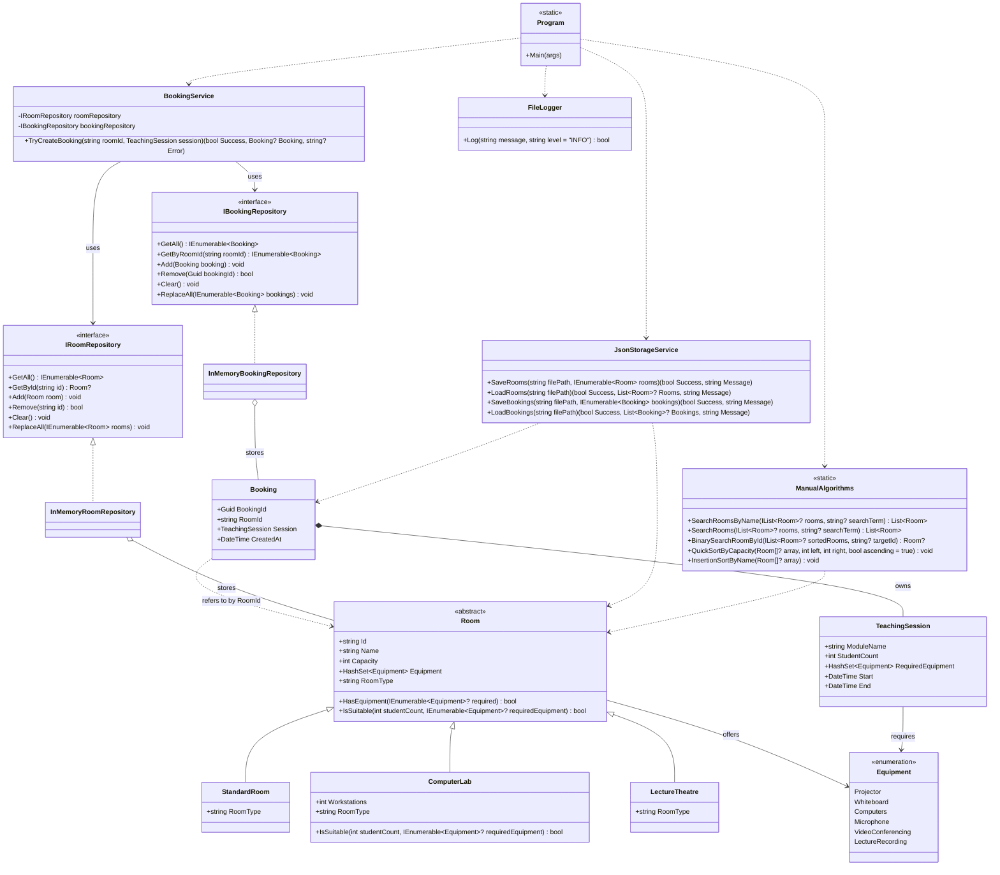
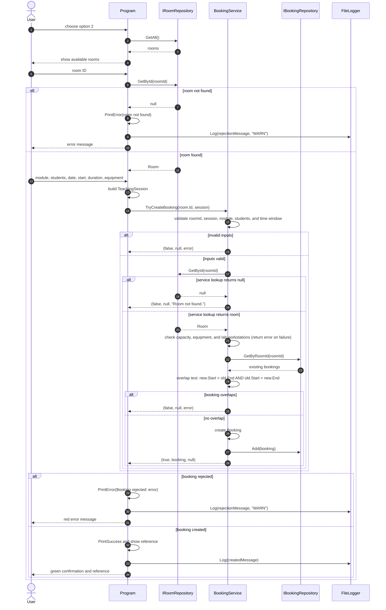

# Design diagrams

## UML class diagram

```mermaid
classDiagram
direction TB

class Room {
  <<abstract>>
  +string Id
  +string Name
  +int Capacity
  +HashSet~Equipment~ Equipment
  +string RoomType
  +HasEquipment(IEnumerable~Equipment~? required) bool
  +IsSuitable(int studentCount, IEnumerable~Equipment~? requiredEquipment) bool
}
class StandardRoom {
  +string RoomType
}
class ComputerLab {
  +int Workstations
  +string RoomType
  +IsSuitable(int studentCount, IEnumerable~Equipment~? requiredEquipment) bool
}
class LectureTheatre {
  +string RoomType
}
class Equipment {
  <<enumeration>>
  Projector
  Whiteboard
  Computers
  Microphone
  VideoConferencing
  LectureRecording
}
class TeachingSession {
  +string ModuleName
  +int StudentCount
  +HashSet~Equipment~ RequiredEquipment
  +DateTime Start
  +DateTime End
}
class Booking {
  +Guid BookingId
  +string RoomId
  +TeachingSession Session
  +DateTime CreatedAt
}
class IRoomRepository {
  <<interface>>
  +GetAll() IEnumerable~Room~
  +GetById(string id) Room?
  +Add(Room room) void
  +Remove(string id) bool
  +Clear() void
  +ReplaceAll(IEnumerable~Room~ rooms) void
}
class IBookingRepository {
  <<interface>>
  +GetAll() IEnumerable~Booking~
  +GetByRoomId(string roomId) IEnumerable~Booking~
  +Add(Booking booking) void
  +Remove(Guid bookingId) bool
  +Clear() void
  +ReplaceAll(IEnumerable~Booking~ bookings) void
}
class InMemoryRoomRepository
class InMemoryBookingRepository
class BookingService {
  -IRoomRepository roomRepository
  -IBookingRepository bookingRepository
  +TryCreateBooking(string roomId, TeachingSession session) (bool Success, Booking? Booking, string? Error)
}
class JsonStorageService {
  +SaveRooms(string filePath, IEnumerable~Room~ rooms) (bool Success, string Message)
  +LoadRooms(string filePath) (bool Success, List~Room~? Rooms, string Message)
  +SaveBookings(string filePath, IEnumerable~Booking~ bookings) (bool Success, string Message)
  +LoadBookings(string filePath) (bool Success, List~Booking~? Bookings, string Message)
}
class FileLogger {
  +Log(string message, string level = "INFO") bool
}
class ManualAlgorithms {
  <<static>>
  +SearchRoomsByName(IList~Room~? rooms, string? searchTerm) List~Room~
  +SearchRooms(IList~Room~? rooms, string? searchTerm) List~Room~
  +BinarySearchRoomById(IList~Room~? sortedRooms, string? targetId) Room?
  +QuickSortByCapacity(Room[]? array, int left, int right, bool ascending = true) void
  +InsertionSortByName(Room[]? array) void
}
class Program {
  <<static>>
  +Main(args)
}

Room <|-- StandardRoom
Room <|-- ComputerLab
Room <|-- LectureTheatre
Room --> Equipment : offers
TeachingSession --> Equipment : requires
Booking *-- TeachingSession : owns
Booking ..> Room : refers to by RoomId
IRoomRepository <|.. InMemoryRoomRepository
IBookingRepository <|.. InMemoryBookingRepository
InMemoryRoomRepository o-- Room : stores
InMemoryBookingRepository o-- Booking : stores
BookingService --> IRoomRepository : uses
BookingService --> IBookingRepository : uses
JsonStorageService ..> Room
JsonStorageService ..> Booking
ManualAlgorithms ..> Room
Program ..> BookingService
Program ..> JsonStorageService
Program ..> FileLogger
Program ..> ManualAlgorithms
```

## Sequence diagram: creating a booking

```mermaid
sequenceDiagram
autonumber
actor User
participant P as Program
participant RR as IRoomRepository
participant S as BookingService
participant BR as IBookingRepository
participant L as FileLogger

User->>P: choose option 2
P->>RR: GetAll()
RR-->>P: rooms
P-->>User: show available rooms
User->>P: room ID
P->>RR: GetById(roomId)
alt room not found
  RR-->>P: null
  P->>P: PrintError(room not found)
  P->>L: Log(rejectionMessage, "WARN")
  P-->>User: error message
else room found
  RR-->>P: Room
  User->>P: module, students, date, start, duration, equipment
  P->>P: build TeachingSession
  P->>S: TryCreateBooking(room.Id, session)
  S->>S: validate roomId, session, module, students, and time window
  alt invalid inputs
	S-->>P: (false, null, error)
  else inputs valid
	S->>RR: GetById(roomId)
	alt service lookup returns null
	  RR-->>S: null
	  S-->>P: (false, null, "Room not found.")
	else service lookup returns room
	  RR-->>S: Room
	  S->>S: check capacity, equipment, and lab workstations (return error on failure)
	  S->>BR: GetByRoomId(roomId)
	  BR-->>S: existing bookings
	  S->>S: overlap test: new.Start < old.End AND old.Start < new.End
	  alt booking overlaps
		S-->>P: (false, null, error)
	  else no overlap
		S->>S: create Booking
		S->>BR: Add(booking)
		S-->>P: (true, booking, null)
	  end
	end
  end
  alt booking rejected
	P->>P: PrintError(Booking rejected: error)
	P->>L: Log(rejectionMessage, "WARN")
	P-->>User: red error message
  else booking created
	P->>P: PrintSuccess and show reference
	P->>L: Log(createdMessage)
	P-->>User: green confirmation and reference
  end
end
```
